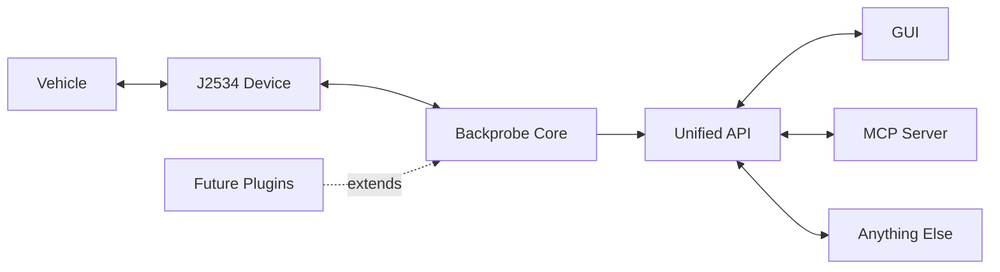

# Backprobe

Backprobe is an abstraction layer between a vehicle and anything that wants
to talk to it. The consumer — a scan tool GUI, a home automation system, a
cellular data service, an MCP server, a custom script — calls a simple,
protocol-free API and gets vehicle data back. It never touches transport
mechanics, CAN framing, or OBD2 protocol details directly. That is
Backprobe's job.

Tools like pyOBD and python-obd already exist, but they are scan tools.
Backprobe is infrastructure.



---

## Design Philosophy

**The core abstraction is the product. The GUI is not. The MCP is not.**

Every consumer calls the same API. The core owns device communication,
session management, and protocol handling. Nothing outside the core ever
needs to know how a vehicle connection works — only that it does.

This separation matters because the consumer could be anything. A shop
diagnostic tool and a home automation hub have nothing in common except
that they both want to know what the vehicle is doing. Backprobe is the
part that makes that possible without writing a CAN stack twice.

---

## Architecture

```
┌─────────────────────────────────────────────────────────────┐
│  TIER 3 — Consumer API     vehicle.read_dtcs(), .stream()   │  ← what apps call
├─────────────────────────────────────────────────────────────┤
│  TIER 2 — Query Engine     probe, census, decode, schedule  │  ← request/response logic
├─────────────────────────────────────────────────────────────┤
│  TIER 1 — Transport        open/connect/send/receive        │  ← one per device kind
├─────────────────────────────────────────────────────────────┤
│  TIER 0 — Vendor DLL       PassThru* / SocketCAN / etc.     │  ← hardware
└─────────────────────────────────────────────────────────────┘
```

Tier boundaries are hard. Tier 3 consumers never see a protocol name, a
PID number, or a CAN frame. New transport backends plug into Tier 1 without
touching the layers above.

---

## Current Status — Phase 1 (in development)

Building the foundation: a terminal daemon that runs on a test bench,
finds J2534 devices, connects to vehicles, and logs a full identity snapshot
per connection. No consumer API yet — Phase 1 puts the entire transport and
protocol stack through real-world testing before any API is published.

**v1 scope:**
- Transport: J2534 only (SAE J2534-1 / 04.04)
- Protocol: OBD2 Modes 01–09 (SAE J1979 / ISO 15031-5)
- Runtime: Windows 10/11, 32-bit Python
- Validated device: Opus IVS Supergoose Plus

**What Phase 1 does:**
- Discovers J2534 devices from the Windows registry automatically
- Holds the device exclusively (same as any OEM application)
- Polls battery voltage to detect vehicle plug-in
- Auto-probes CAN flavor (11-bit/500k → 29-bit/500k → 250k)
- Harvests: VIN, ECU census, supported PIDs, MIL status, DTC count,
  Mode 06 monitor results, battery voltage
- Writes a JSON-lines event log — one record per step, machine and human
  readable
- Releases the device completely on every exit, including crash and kill

---

## Roadmap

| Phase | What | Status |
|---|---|---|
| 1 | Terminal daemon — device ownership, probe, vehicle snapshot, event log | In development |
| 2 | Consumer API — freeze Phase 1 machinery behind a published interface | Planned |
| 3 | Test harness consumers — GUI scan tool + MCP server | Planned |
| Later | Additional transports, K-line/J1850, manufacturer plugins | Designed-for |

---

## Background

This project was built by an automotive diagnostic technician. The goal was
simple: make vehicle data available to anything that wants it, through one
clean interface, without requiring every consumer to understand J2534 or
CAN framing.

The right to repair matters. Complex modern vehicles should not require
proprietary tooling to understand. Backprobe is one piece of that.

---

## Repository Layout

```
Backprobe/              active development
OldVer/                 v0.1.4 reference archive
J2534 Reference Docs/   SAE J2534 spec, Supergoose docs
```

---

## Requirements (Phase 1)

- Windows 10/11
- Python 3.11+ (32-bit)
- A SAE J2534-1 compliant passthru device with drivers installed

---

## Contributing

Contributors are responsible for ensuring they have the right to submit
contributed materials. This project is developed with the assistance of AI
coding tools under the direction of the project maintainer. Any contributor
who identifies improperly licensed or unsuitable material is asked to report
it to the maintainer for review.
