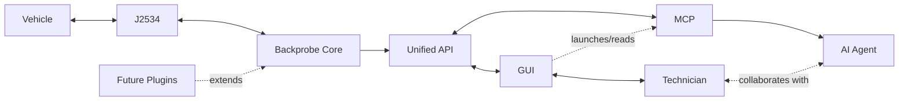

# Backprobe
Backprobe is an Open Source automotive diagnostic platform with built in API support. The goal is for AI Agents to actively participate in diagnostics by givng them structured access to the vehicle's data via the OBD2 port. The roadmap is to include releases that support all major generic OBD protocols and OEM specific data via plug ins. AI Agents cannot write to a vehicle at this time or perform bidirectional tests, and that feature is not currently advised for development. 

Backprobe is based upon a Python architecture and currently uses non-proprietary protocols to perform its tasks. In it's current form, Backprobe is a Mode 1-9 diagnostic scan tool, similar to most handheld scanners you can buy for under $100 but with major benefits.

## *Design Philosophy*

Backprobe is built around a simple principle:

The GUI, MCP server, and future integrations should all consume the same API. Vehicle communication, diagnostic logic, and user interfaces are intentionally separated into the core. The core handles j2534 calls, device identification, and hands off relevant instructions to the frontend via API. The front end should never have to think about HOW to connect to a car. 

## *Current Status & How to Use/Install*

  Currently in Proof of Concept Stage. CAN is currently working through j2534 drivers. Actively working on building the core to support the OPUS IVS Supergoose Plus as the first validated device, mapping j2534 to drivers and protocols, and creating a foundation for API. 
  
 - GUI and Modes 1 thru 4, 6 thru 9 Functional
 - Session Logging Functional
 - MCP Not Tested
 - GUI properly calling j2534 Drivers
    
  No installer currently exists for Backprobe, but a Windows 10/11 machine with Python installed is the basic requirement. j2534 protocol is Windows dependent. 

## *Screenshots*
  HTML GUI mockups in repo under /Style Guide

## *What is Backprobe*

  Backprobe was created to bridge the gap between the Technician, the Scan Tool, and a Diagnostic Assisnt (AI). Most "AI" commercial scan tools are simply LLMs reading a trouble code using a screen reader and dumping you into a generic pathway. They are not actually interpretting the data coming from the tool. This is where Backprobe is fundamentally different. Due to the simplified API, AI agents can integrate natively with the vehicle with the same calls as a scan tool with significantly fewer tokens than being handed a set of drivers or raw CAN with a decoder. 

## *Who am I*

  I am an automotive diagnostic technician, first and foremost. After playing around some AI models, I found that they have become quite capable and were coming to many of the same conclusions I was when it came to diagnosing cars. I was making this tool for myself to play around with AI coding tools and see if what I wanted was possible and thought that, if I could make it then OF COURSE the big names in the industry would too. I am a firm believer in the right to repair and want to give everyone the chance to fix their complex modern vehicles. 

## *AI-Assisted Development, Contribution, and General Licensing Notice*

 - This project is developed with the assistance of AI coding tools under the direction of the project maintainer.
 - Contributors are responsible for ensuring they have the right to contribute submitted materials. 
 - All code released in this repository is believed to be original work or used in accordance with the licenses of its respective dependencies and third-party components.
 - Any contributor who identifies copyrighted material, improperly licensed materia, or material otherwise unsuitable for use in this project is asked to report it to the project maintainer for review. 
