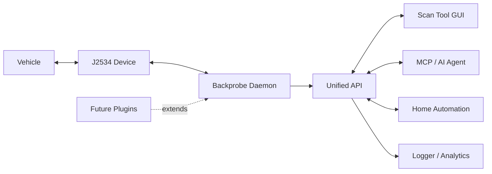

# Backprobe

Backprobe is an abstraction layer between a vehicle and anything that wants to talk to it. The consumer calls a simple, protocol-free API and gets vehicle data back. It never touches transport mechanics, CAN framing, or OBD2 protocol details. That is Backprobe's job. Backprobe is infrastructure. 

# Potenial Uses

 - Home Automation (crack garage door when vehicle remote starts)
 - Self hosted fleet tracking (get a text when a truck's CEL comes on)
 - AI diagnostic assistant (agent gets a direct stream of data instead of screenshots)
 - Open source scan tools (can add manufacturer specific plug ins)



---

## *What is Backprobe*

Most scan tools are closed systems. They talk to the vehicle, show the data on their own screen, and stop there. If you want to do something interesting with that data, you are on your own.

Backprobe flips that. The daemon owns the vehicle connection and puts the data on an open wire protocol. Anything that can speak JSON over a TCP socket can consume it — a GUI, a home automation platform, an MCP server, a logger, a data pipeline, whatever you build. The consumer never has to know what J2534 or SocketCAN is, how CAN framing works, or which ISO standard covers Mode 06 monitor tests. That knowledge lives in Backprobe and never leaks out. If standards/regulations change then Backprobe can be updated with little or no change to the consumer-facing API. 

This matters especially for AI. Due to the simplified API, AI agents can integrate natively with the vehicle with the same calls as a scan tool with significantly fewer tokens than being handed a set of drivers or raw CAN with a decoder. 

---

## Architecture

```
┌─────────────────────────────────────────────────────────────┐
│  TIER 3 — Consumer API     vehicle.read_dtcs(), .stream()   │  ← what apps call
├─────────────────────────────────────────────────────────────┤
│  TIER 2 — Query Engine     probe, census, decode, schedule  │  ← request/response logic
├─────────────────────────────────────────────────────────────┤
│  TIER 1 — Transport        open/connect/send/receive        │  ← one per device kind
├─────────────────────────────────────────────────────────────┤
│  TIER 0 — Vendor DLL       PassThru* / SocketCAN / etc.     │  ← hardware
└─────────────────────────────────────────────────────────────┘
```

Tier boundaries are hard. Tier 3 consumers never see a protocol name, a PID number, or a CAN frame. New transport backends plug into Tier 1 without touching the layers above. Manufacturer-specific command sets and future plugins slot into Tier 2 and surface new commands to Tier 3. 

---

## *Current Status*

**Phase 1 is complete.** The terminal daemon runs unattended on the bench, finds J2534 devices automatically, and produces a full vehicle identity snapshot on plug-in — VIN, ECU census, supported PIDs, MIL status, DTC count, Mode 06 monitor results, battery voltage. Validated on real vehicles, including multi-ECU vehicles with engine and transmission responding independently, and confirmed that device-loss recovery leaves no wedged device behind.

**Phase 2 is in design.** The daemon wire protocol is fully specified — JSON-RPC 2.0 over TCP, two channels (admin for commands, stream for live data push), consumer-agnostic. Implementation begins next.

**v1 scope:**
- Transport: J2534 only (SAE J2534-1 / 04.04)
- Protocol: OBD2 Modes 01–0A (SAE J1979 / ISO 15031-5)
- Runtime: Windows 10/11, 32-bit Python
- Validated device: Opus IVS Supergoose Plus

---

## Roadmap

| Phase | What | Status |
|---|---|---|
| 1 | Terminal daemon — device ownership, probe, vehicle snapshot, event log | ✅ Complete |
| 2 | Consumer API — daemon wire protocol, JSON-RPC, live data streaming | In design |
| 3 | Test harness consumers — GUI scan tool + MCP server | Planned |
| Later | Additional transports, K-line/J1850, manufacturer plugins | Designed-for |

---

## Requirements

- Windows 10/11
- Python 3.11+ (32-bit)
- A SAE J2534-1 compliant passthru device with drivers installed

Phase 2 will add a consumer side requirement: anything that can open a TCP socket and speak JSON.

---

## *Who am I*

I am an automotive diagnostic technician, first and foremost. After spending time with AI models I found they were reaching many of the same diagnostic conclusions I was — given the right data. I built this tool for myself to see if what I wanted was possible, and realized quickly that if I could do it, the big names in the industry could, too.

I am a firm believer in the right to repair. Complex modern vehicles should not require proprietary tooling to repair. Backprobe could be one piece of that.

---

## Repository Layout

```
backprobe/          the Python package
tests/              test suite
Design Docs/        architecture decisions and protocol specifications
OldVer/             v0.1.4 reference archive (proof of concept — working generic scan tool w/o bidirectional control)
```

---

## *AI-Assisted Development, Contribution, and General Licensing Notice*

- This project is developed with the assistance of AI coding tools under the direction of the project maintainer.
- Contributors are responsible for ensuring they have the right to contribute submitted materials.
- All code released in this repository is believed to be original work or used in accordance with the licenses of its respective dependencies and third-party components.
- Any contributor who identifies copyrighted material, improperly licensed material, or material otherwise unsuitable for use in this project is asked to report it to the project maintainer for review.
